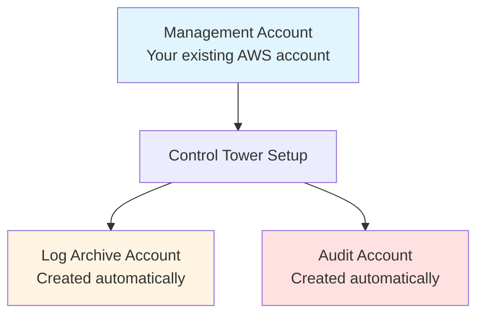
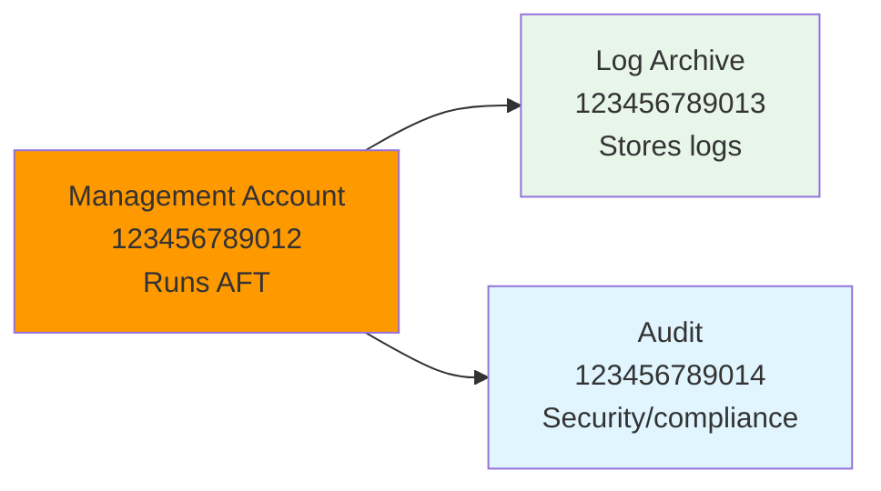
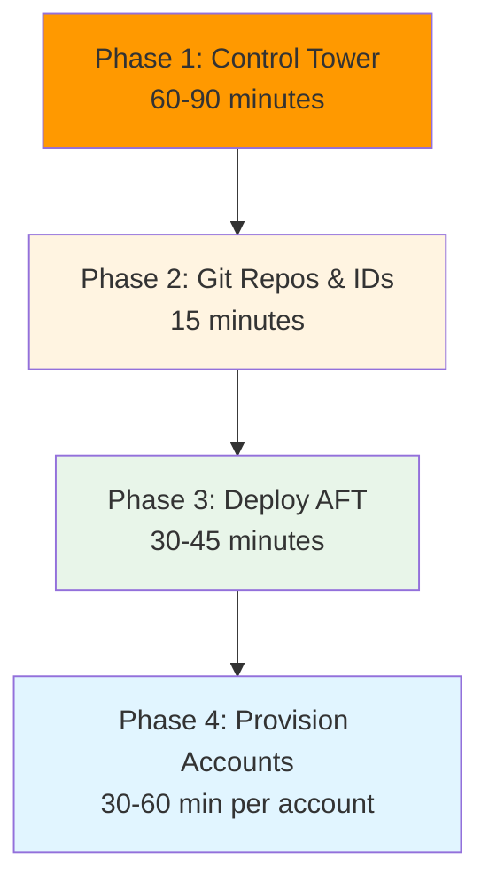

# Prerequisites & Setup

## Before You Start with AFT

Three phases to get AFT working

---

## Phase 1: AWS Control Tower Setup

**FIRST: You need Control Tower**

This is the foundation for everything.

---

## What is Control Tower?

**AWS Control Tower** = Multi-account AWS environment management

**What it does:**
- Creates organizational structure (OUs)
- Establishes guardrails (preventive & detective)
- Sets up centralized logging
- Creates foundational accounts automatically

**You must set this up BEFORE AFT**

---

## Control Tower Creates These Accounts



**Control Tower automatically creates:**
1. **Log Archive Account** - Centralized logging
2. **Audit Account** - Security and compliance

---

## Phase 1: Control Tower Setup Steps

**In AWS Console:**

1. Navigate to AWS Control Tower
2. Click "Set up landing zone"
3. Choose home region (e.g., eu-west-2)
4. Configure:
   - Log Archive email: `aws-log-archive@example.com`
   - Audit email: `aws-audit@example.com`
5. Click "Set up landing zone"
6. **Wait 60-90 minutes**

**Result:** Three accounts ready
- Management Account (your original)
- Log Archive Account (new - created by Control Tower)
- Audit Account (new - created by Control Tower)

---

## The Three Foundational Accounts



**Management Account:**
- Your original AWS account
- Where you deploy AFT
- Controls everything

**Log Archive Account:**
- Created by Control Tower
- Stores CloudTrail logs
- Centralized logging

**Audit Account:**
- Created by Control Tower
- Security tooling
- Compliance auditing

---

## Phase 1 Complete: What You Have

✅ Control Tower enabled  
✅ Management Account (your original)  
✅ Log Archive Account (created)  
✅ Audit Account (created)  
✅ Organizational structure (OUs)  
✅ Basic guardrails active  

**Cost:** ~£10-15/month for Control Tower

**Now you're ready for Phase 2: Deploy AFT**

---

## Phase 2: Create Git Repositories

**Before deploying AFT, create these four repos:**

1. `aft-account-request`
2. `aft-global-customisations`
3. `aft-account-customisations`
4. `aft-account-provisioning-customisations`

**Can be empty initially, but must exist**

**On GitHub/GitLab:**
- Create each repository
- Initialize with README
- Make them accessible to AFT

---

## Phase 2: Collect Account IDs

**You need these for AFT deployment:**

```bash
# Management Account ID
aws sts get-caller-identity --query Account --output text
# Output: 123456789012

# Log Archive Account ID
# (Check AWS Organizations or Control Tower dashboard)
# Output: 123456789013

# Audit Account ID  
# (Check AWS Organizations or Control Tower dashboard)
# Output: 123456789014
```

**Write these down - you'll need them for AFT configuration**

---

## Phase 3: Deploy AFT Infrastructure

**Now you can deploy AFT**

This is covered in the next section.

---

## The Complete Journey



**Total setup time:** ~2-3 hours (one-time)  
**Then:** Provision accounts in 30-60 minutes each

---

## Phase Summary

### Phase 1: Control Tower (ONE-TIME)
- Enable Control Tower
- Creates Log Archive Account
- Creates Audit Account
- Time: 60-90 minutes
- Cost: ~£10-15/month

### Phase 2: Preparation (ONE-TIME)
- Create four Git repositories
- Collect account IDs
- Time: 15 minutes
- Cost: £0 (Git repos are free)

### Phase 3: AFT Deployment (ONE-TIME)
- Deploy AFT infrastructure
- Connect to Git repos
- Time: 30-45 minutes
- Cost: ~£3-5/month

### Phase 4: Account Provisioning (ONGOING)
- Provision new accounts
- Automated via Git
- Time: 30-60 minutes per account
- Cost: ~£1-2 per account

---

## Prerequisites Checklist

**Before deploying AFT, ensure you have:**

- [ ] AWS Control Tower enabled
- [ ] Management Account ID noted
- [ ] Log Archive Account ID noted
- [ ] Audit Account ID noted
- [ ] Home region decided (e.g., eu-west-2)
- [ ] Four Git repositories created
- [ ] Git provider credentials ready
- [ ] Terraform installed locally
- [ ] AWS CLI configured

**Once all checked:** Ready to deploy AFT!

---

## Cost Breakdown

**One-time setup:**

| Phase | Cost |
|-------|------|
| Control Tower | ~£10-15/month |
| Git repositories | £0 |
| AFT infrastructure | ~£3-5/month |
| **Total base cost** | **~£15-20/month** |

**Per account provisioned:** ~£1-2 each

**Total for 10 accounts:** ~£30-35/month

---

## Common Setup Questions

**Q: Can I use existing accounts for Log Archive/Audit?**  
A: No, Control Tower must create these fresh

**Q: Can I change the Log Archive/Audit account emails later?**  
A: No, these are set during Control Tower setup

**Q: Do I need to configure the Log Archive/Audit accounts?**  
A: No, Control Tower configures them automatically

**Q: Can I deploy AFT without Control Tower?**  
A: No, AFT requires Control Tower

**Q: How long does Control Tower setup take?**  
A: 60-90 minutes typically
