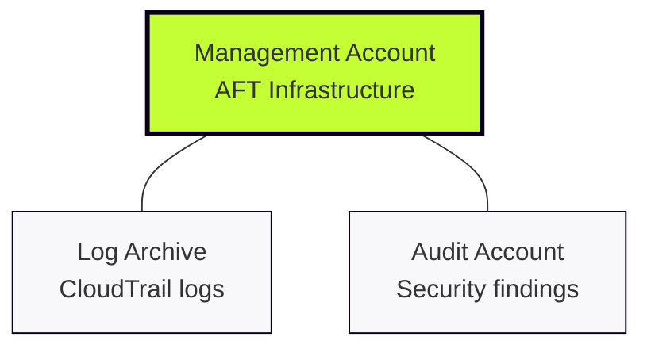
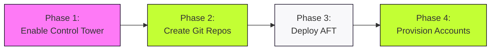

# AFT: Technical Mission Briefing

## The Objective
**AWS Account Factory for Terraform (AFT)** is our dedicated orchestration engine for AWS Control Tower. We are moving from manual "ticket-ops" to a pure **GitOps** workflow: commit HCL, trigger the pipeline, and have a fully hardened, compliant account ready.

[AWS AFT Documentation](https://docs.aws.amazon.com/controltower/latest/userguide/aft-overview.html)

---

## Why This Matters (The GitOps Shift)
* **Standardised Delivery:** No more "snowflake" accounts; every VPC and IAM role is identical by design
* **Rapid Scaling:** Provision ten project accounts as easily as one
* **Immutable Audit Trail:** Every change is documented in Git history and mirrored in DynamoDB audit tables
* **Engineer Autonomy:** Shift-left security by allowing teams to request accounts via Pull Request

---

## Control Tower: The Foundation

Before deploying AFT, enable AWS Control Tower (one-time setup):

**What happens:**
1. Your existing AWS account becomes the **Management Account**
2. Control Tower **automatically creates** two new accounts:
   - **Log Archive** - centralised logging
   - **Audit** - security and compliance

**What you provide:** Email addresses for Log Archive and Audit  
**What Control Tower does:** Creates accounts, applies baseline, configures OUs

[AWS Control Tower Setup Guide](https://docs.aws.amazon.com/controltower/latest/userguide/setting-up.html)

---

## The Three-Account Architecture

**Management:** Hosts the AFT stack and orchestration workflows  
**Log Archive:** Centralised repository for all API and resource logs  
**Audit:** Central hub for GuardDuty and Security Hub findings

---

## The Four-Phase Journey

**One-time setup:** Phases 1-3  
**Ongoing operations:** Phase 4

---

## The Four Mandatory Repositories

AFT requires four Git repositories before deployment:

1. **aft-account-request**: Entry point for new account HCL files
2. **aft-global-customisations**: Resources applied to all accounts
3. **aft-account-customisations**: Account-specific configurations
4. **aft-account-provisioning-customisations**: Pre-baseline configurations

**Note:** Repositories can be empty initially but must exist before deploying AFT.

[AFT Repository Requirements](https://docs.aws.amazon.com/controltower/latest/userguide/aft-getting-started.html#aft-repo-requirements)

---

## Engineer Checklist

**Before deploying AFT:**
* [ ] **Control Tower Landing Zone active**
* [ ] **Three account IDs collected** (Management, Log Archive, Audit)
* [ ] **Four Git repositories created**
* [ ] **Git integration configured** (PAT or SSH keys)
* [ ] **AWS IAM Identity Centre (SSO) active**
* [ ] **Terraform environment ready**

**Once these are ready, you can deploy AFT.**