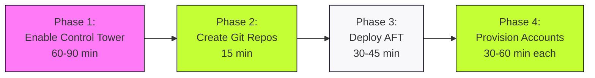
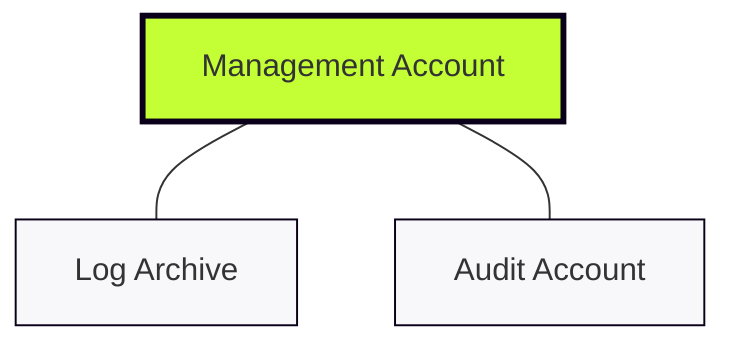

# AFT: Technical Mission Briefing

## The Objective
**AWS Account Factory for Terraform (AFT)** is our dedicated orchestration engine for AWS Control Tower.
We are moving from manual "ticket-ops" to a pure **GitOps** workflow: commit HCL, trigger the pipeline, and have a fully hardened, compliant account ready in under 60 minutes.

---

## Control Tower Prerequisites

Before deploying AFT, you must enable AWS Control Tower. This is a **one-time setup** that:

1. Takes your existing AWS account (becomes **Management Account**)
2. **Automatically creates** two new AWS accounts:
   - **Log Archive Account** - for centralised logging
   - **Audit Account** - for security and compliance

**Critical:** You don't manually provision Log Archive and Audit accounts. Control Tower creates them automatically when you enable the Landing Zone. You only provide the email addresses.

**Setup time:** 60-90 minutes (one-time)

---

## Why This Matters (The GitOps Shift)
* **Standardised Delivery:** No more "snowflake" accounts; every VPC and IAM role is identical by design.
* **Rapid Scaling:** Provision ten project accounts as easily as one.
* **Immutable Audit Trail:** Every change is documented in Git history and mirrored in DynamoDB audit tables.
* **Engineer Autonomy:** Shift-left security by allowing teams to request accounts via Pull Request.

---

## The Four-Phase Implementation

**Phase 1:** Control Tower creates Log Archive + Audit accounts (one-time)  
**Phase 2:** Initialise four Git repositories (one-time)  
**Phase 3:** Deploy AFT infrastructure in Management account (one-time)  
**Phase 4:** Provision accounts via Git commits (ongoing)

---

## Foundational Environment
AFT orchestrates actions across our three core Control Tower accounts:

| Account | The AFT Role | Primary Function |
| :--- | :--- | :--- |
| **Management** | **The Brain** | Hosts the AFT stack and the DynamoDB state/audit tables. |
| **Log Archive** | **The Vault** | Centralised repository for all API and resource logs. |
| **Audit** | **The Sentry** | Central hub for GuardDuty and Security Hub findings. |

---

## Technical Relationship

---

## Account Creation Clarification

**Common Question:** "Do I need to manually create the Log Archive and Audit accounts?"

**Answer:** **NO!**

Control Tower creates these automatically during Landing Zone setup. You only provide:
- Email address for Log Archive: `aws-logs@example.com`
- Email address for Audit: `aws-audit@example.com`

Control Tower handles account provisioning, baseline configuration, and OU placement. After setup completes (60-90 minutes), you'll have three accounts ready for AFT deployment.

---

## Mandatory Repositories

To trigger the automated workflow, AFT requires the initialisation of **four mandatory Git repositories**:

1. **aft-account-request**: The entry point where new account HCL files are committed.
2. **aft-global-customisations**: Resources applied to every account created by AFT.
3. **aft-account-customisations**: Account-specific Terraform configurations.
4. **aft-account-provisioning-customisations**: Configurations applied before the Control Tower baseline.

**Note:** Repositories can be empty initially but must exist before deploying AFT.

---

## Engineer Checklist

**Before AFT Deployment:**
* [ ] **Control Tower Enabled**: Landing Zone active (creates Log Archive + Audit accounts automatically)
* [ ] **Three Account IDs Collected**: Management, Log Archive, Audit
* [ ] **Email Addresses Configured**: For Log Archive and Audit accounts
* [ ] **Home Region Selected**: e.g., eu-west-2
* [ ] **Four Git Repositories Created**: Can be empty initially
* [ ] **Git Integration**: PAT or SSH keys configured for Git provider
* [ ] **SSO Configured**: AWS IAM Identity Center active
* [ ] **Terraform Ready**: v1.0+ installed, environment configured to bootstrap AFT module

**After AFT Deployment:**
* [ ] **EventBridge Rules Active**: Watching Git repositories for commits
* [ ] **DynamoDB Tables Created**: State and audit tracking operational
* [ ] **Step Functions Deployed**: Account provisioning workflow ready
* [ ] **Lambda Functions Active**: Validation and processing engines running
