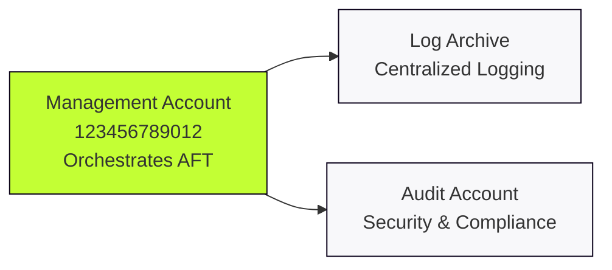

```markdown
# AFT Overview & Requirements

## The Mission
**AWS Account Factory for Terraform (AFT)** provides a specialized orchestration layer on top of AWS Control Tower. 
It enables a **GitOps** workflow where committing HCL to a repository triggers an automated pipeline that provisions and hardens accounts in under 60 minutes.

---

## Why AFT? (The GitOps Shift)
* **Infrastructure as Code:** Replaces manual "Console-ops" with version-controlled Terraform.
* **Consistency:** Ensures every account adheres to the exact same security and networking baseline.
* **Scalability:** Enables the simultaneous provisioning of multiple accounts across different OUs.
* **Auditability:** Every change is tracked via Git history and logged in centralized DynamoDB audit tables.

---

## Foundational Structure
AFT leverages the **AWS Control Tower** landing zone as its foundation. 
It orchestrates actions across the three primary accounts created during the landing zone setup:


| Account | Role in AFT | Key Function |
| :--- | :--- | :--- |
| **Management** | **The Orchestrator** | Hosts the AFT management stack and DynamoDB audit tables. |
| **Log Archive** | **The Vault** | Central destination for API logs generated by AFT-provisioned accounts. |
| **Audit** | **The Sentry** | Centralizes security notifications and compliance findings for the estate. |

---

## Technical Relationship



---

## Mandatory Repositories

To trigger the automated workflow, AFT requires the initialization of **four mandatory Git repositories**:

1. **aft-account-request**: The entry point where new account HCL files are committed.
2. **aft-global-customisations**: Resources applied to every account created by AFT.
3. **aft-account-customisations**: Account-specific Terraform configurations.
4. **aft-account-provisioning-customisations**: Configurations applied before the Control Tower baseline.

---

## Engineer Checklist

* [ ] **Control Tower Enabled**: Landing Zone must be active in the Management account.
* [ ] **Account IDs Collected**: Management, Audit, and Log Archive IDs are required for deployment.
* [ ] **Git Integration**: Personal Access Tokens (PAT) or SSH keys configured for your Git provider.
* [ ] **SSO Configured**: AWS IAM Identity Center active for post-provisioning access.
* [ ] **Terraform Ready**: Local environment configured to bootstrap the AFT module.

