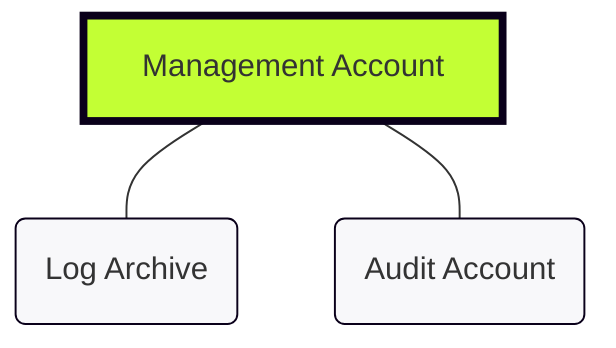

# AFT: Technical Mission Briefing

## The Objective
**AWS Account Factory for Terraform (AFT)** is our dedicated orchestration engine for AWS Control Tower.
We are moving from manual "ticket-ops" to a pure **GitOps** workflow: commit HCL, trigger the pipeline, and have a fully hardened, compliant account ready in under 60 minutes.

---

## Why This Matters (The GitOps Shift)
* **Standardised Delivery:** No more "snowflake" accounts; every VPC and IAM role is identical by design.
* **Rapid Scaling:** Provision ten project accounts as easily as one.
* **Immutable Audit Trail:** Every change is documented in Git history and mirrored in DynamoDB audit tables.
* **Engineer Autonomy:** Shift-left security by allowing teams to request accounts via Pull Request.

---

## Foundational Environment
AFT orchestrates actions across our three core Control Tower accounts:

| Account | The AFT Role | Primary Function |
| :--- | :--- | :--- |
| **Management** | **The Brain** | Hosts the AFT stack and the DynamoDB state/audit tables. |
| **Log Archive** | **The Vault** | Centralised repository for all API and resource logs. |
| **Audit** | **The Sentry** | Central hub for GuardDuty and Security Hub findings. |

---

## Technical Relationship


---

## Mandatory Repositories

To trigger the automated workflow, AFT requires the initialization of **four mandatory Git repositories**:

1. **aft-account-request**: The entry point where new account HCL files are committed.
2. **aft-global-customisations**: Resources applied to every account created by AFT.
3. **aft-account-customisations**: Account-specific Terraform configurations.
4. **aft-account-provisioning-customisations**: Configurations applied before the Control Tower baseline.

---

## Engineer Checklist

* [ ] **Control Tower Enabled**: Landing Zone active in Management account.
* [ ] **Account IDs Collected**: Management, Audit, and Log Archive IDs ready.
* [ ] **Git Integration**: PAT or SSH keys configured for Git provider.
* [ ] **SSO Configured**: AWS IAM Identity Center active.
* [ ] **Terraform Ready**: Environment configured to bootstrap AFT module.

```

