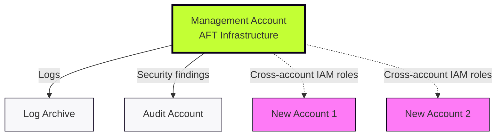
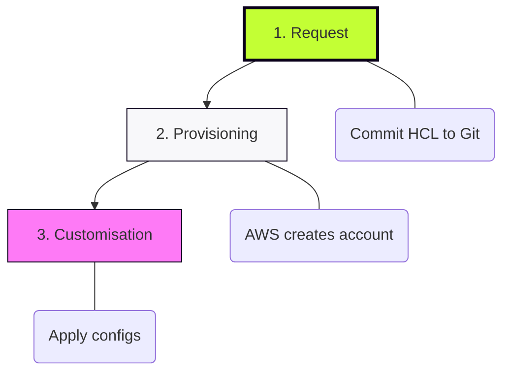
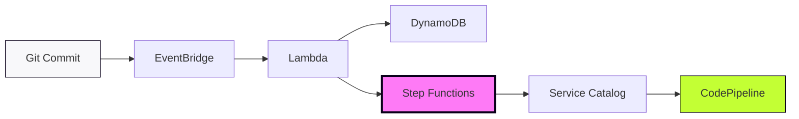

# AFT Architecture & Deployment

## Deploying the AFT Stack (One-Time)

**In the Management Account, AFT provisions:**

* **Request Framework:** EventBridge, Lambda validators, DynamoDB
* **Provisioning Framework:** Step Functions, Service Catalog integration, IAM roles
* **Customisation Framework:** CodePipeline templates, CodeBuild, S3 state buckets

**Deployment:** 30-45 minutes, requires Administrator privileges  
**Prerequisites:** Control Tower enabled, four Git repos created, account IDs ready

---

## Where AFT Lives

AFT runs in Management account, uses cross-account IAM roles (no access keys).

---

## The Request Lifecycle (Ongoing)

---

## How It Works: The Components

**1. Request Validation:**
* EventBridge detects Git commit
* Lambda validates HCL (syntax, duplicates, OU IDs)
* DynamoDB stores request metadata

**2. Account Provisioning:**
* Step Functions orchestrates workflow (with retry logic)
* Service Catalog creates account + Control Tower baseline (10-15 mins)
* Cross-account IAM role established

**3. Customisation:**
* CodePipeline spawned per account
* Terraform applies: Provisioning → Global → Account customisations (30-40 mins)

---

## Timeline: Commit to Ready

| Time | Activity |
|:---|:---|
| **T+0** | Git commit to `aft-account-request` |
| **T+2 min** | Lambda validates request |
| **T+5 min** | Step Functions start orchestration |
| **T+15 min** | Account created + Control Tower baseline applied |
| **T+45 min** | All customisations complete |
| **Done** | Account ready for use |

**Note:** Multiple accounts provision in parallel. 10 accounts = 60 minutes total, not 600 minutes.

---

## Security Architecture

**State Management:**
* Each account: dedicated S3 bucket + DynamoDB lock table
* KMS encryption for all state files
* No shared state between accounts

**Access Control:**
* Cross-account IAM roles (no access keys)
* Least-privilege policies
* `AWSAFTExecution` role created by Control Tower

**Governance:**
* Control Tower guardrails inherited automatically
* CloudTrail logs → Log Archive account
* Security findings → Audit account

---

## Failure Handling

**Validation Fails:** Lambda rejects immediately, logs to CloudWatch  
**Service Catalog Timeout:** Step Functions retry (3 attempts with backoff)  
**Terraform Failure:** CodePipeline halts, logs available in CodeBuild

Every failure state persisted in DynamoDB for troubleshooting.
