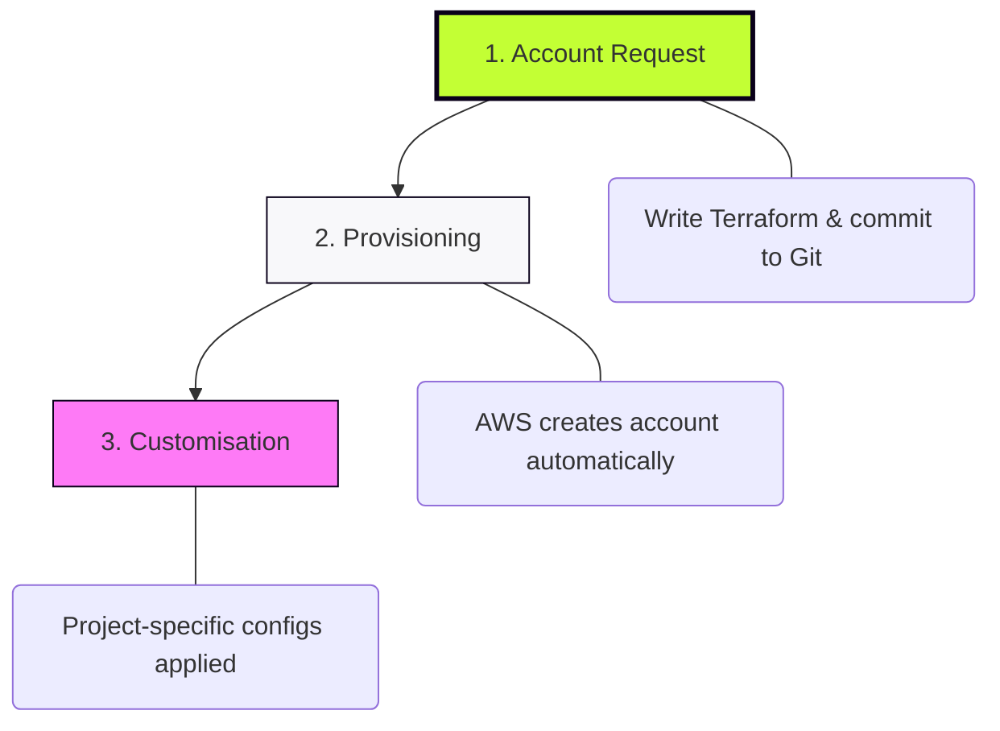
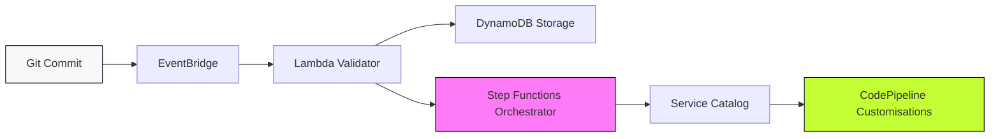

### 02-architecture.md

```markdown
# AFT Architecture & Deployment

## Deploying the AFT Management Stack
Before we can process requests, the AFT engine must be deployed into the **Management Account**. This is a one-time bootstrap process using the official AWS AFT Terraform module to establish our automation hub.

* **Home Region:** Deployed in the same region as the Control Tower Landing Zone.
* **VCS Integration:** Establishes the secure connection to our four mandatory Git repositories.
* **Execution:** Requires Administrator privileges to provision the orchestration pipelines and IAM roles.

---

## The Request Lifecycle
Individual account requests follow a three-stage automated journey.



---

## The Components: Under the Hood

AFT operates as a distributed system to ensure every account is validated and hardened.



### 1. Request Handler

* **EventBridge:** Detects the commit and triggers the initial workflow.
* **Lambda Validator:** Performs logic checks on the HCL request.
* **DynamoDB Storage:** Persists the validated request metadata.

### 2. Provisioning

* **Step Functions:** Orchestrates the multi-account creation logic.
* **Service Catalog:** Executes the actual account creation (approx. 10 mins).

### 3. Customisation

* **CodePipeline:** A dedicated pipeline is spawned per account.
* **Terraform Apply:** Your specific HCL configs are applied (20-40 mins).

---

## What Actually Happens (The Timeline)

From `git push` to a live project environment:

* **T+0 mins:** You commit and push HCL to the `aft-account-request` repo.
* **T+2 mins:** **EventBridge** detects change; **Lambda** validates request.
* **T+5 mins:** **Step Functions** trigger the creation workflow.
* **T+15 mins:** AWS creates the account and applies Control Tower guardrails.
* **T+45 mins:** Individual pipelines apply project-specific **customisations**.
* **Done:** Account is hardened, compliant, and ready for use.

---

## Security & State Management

Security and isolation are maintained across the entire estate.

* **State Isolation:** Each account has a dedicated S3 bucket and DynamoDB lock table for its Terraform state.
* **Encryption:** All state files and sensitive metadata are encrypted via AWS KMS.
* **Governance:** Control Tower guardrails and baseline policies are inherited automatically.
