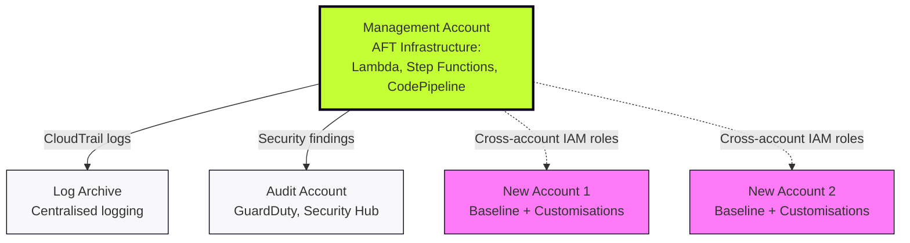
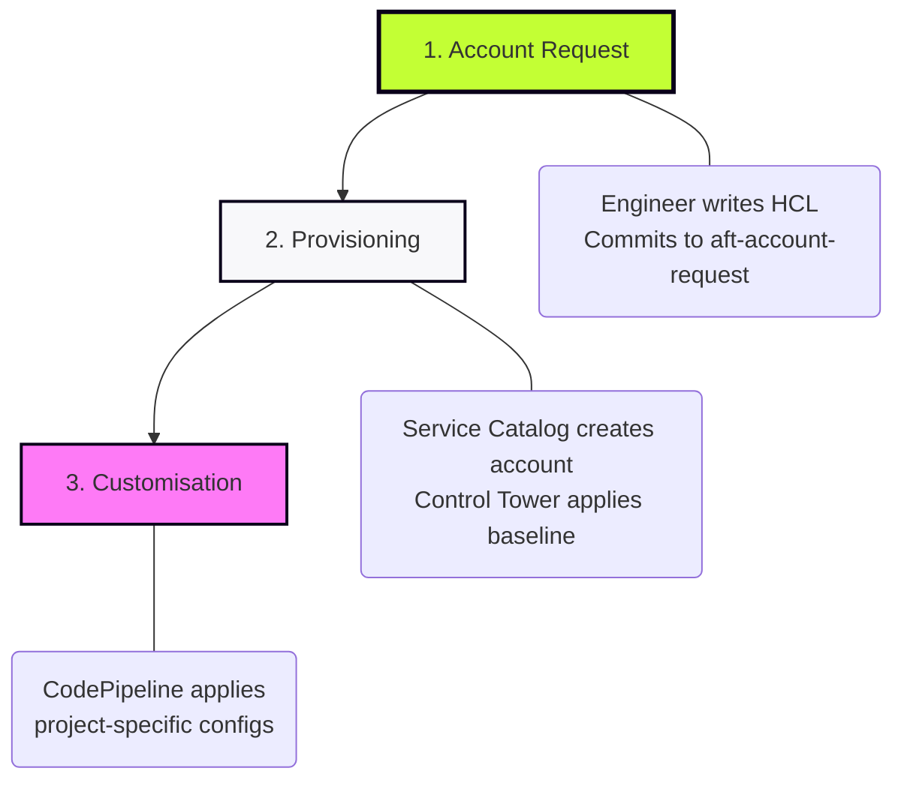
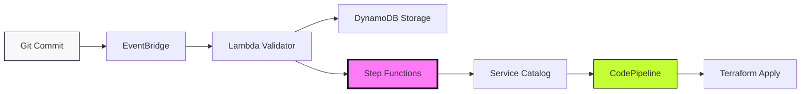

# AFT Architecture & Deployment

## Phase 3: Deploying the AFT Stack

**This is a one-time bootstrap operation in the Management Account.**

The AFT Terraform module provisions the entire automation infrastructure:

**Request Framework:**
* EventBridge rules (watching the four Git repositories)
* Lambda validators (HCL syntax, duplicate detection, email validation)
* DynamoDB tables (request metadata, audit trail, state tracking)
* SQS queues (request buffering and retry handling)

**Provisioning Framework:**
* Step Functions workflows (orchestration with automatic retry logic)
* Service Catalog integration (Control Tower account creation)
* Cross-account IAM roles (access to Log Archive, Audit, and new accounts)

**Customisation Framework:**
* CodePipeline templates (spawned per account)
* CodeBuild projects (Terraform plan/apply execution)
* S3 buckets (Terraform state per account, encrypted)
* SNS topics (pipeline notifications and approval gates)

**Deployment time:** 30-45 minutes  
**Execution:** Requires Administrator privileges in Management Account  
**Prerequisites:** Control Tower enabled, four Git repos created, account IDs collected

---

## Where AFT Lives

AFT infrastructure runs entirely in the **Management Account** and uses cross-account IAM roles to orchestrate actions across the estate.

**Key point:** AFT never uses access keys. All cross-account operations use IAM roles with least-privilege policies.

---

## Phase 4: The Account Request Lifecycle

Once AFT is deployed, account provisioning becomes a three-stage automated journey triggered by Git commits.

---

## The Components: Distributed System Architecture

AFT operates as a distributed, event-driven system to ensure validation, orchestration, and hardening of every account.

### Stage 1: Request Handling & Validation

**EventBridge:**
* Detects commits to the four Git repositories
* Triggers Lambda within seconds of push

**Lambda Validator:**
* Parses HCL syntax
* Checks for duplicate account names/emails
* Validates OU IDs and tag structure
* Rejects invalid requests immediately

**DynamoDB Storage:**
* Persists validated request metadata
* Maintains audit trail (who, what, when)
* Tracks provisioning state transitions

---

### Stage 2: Account Provisioning

**Step Functions Orchestrator:**
* Coordinates multi-step workflow
* Implements automatic retry logic (exponential backoff)
* Handles transient AWS API errors
* Updates DynamoDB state at each checkpoint

**Service Catalog:**
* Executes actual AWS account creation (10-15 mins)
* Applies Control Tower baseline (guardrails, logging)
* Configures SSO access
* Places account in specified OU

**Cross-Account IAM Role:**
* AFT assumes `AWSAFTExecution` role in new account
* Least-privilege access for Terraform operations
* Temporary credentials (no static keys)

---

### Stage 3: Customisation Pipelines

**CodePipeline (Per Account):**
* Dedicated pipeline spawned for each new account
* Four-stage workflow: Source → Plan → Approval (optional) → Apply

**Terraform Execution:**
* **Provisioning Customisations:** Run first (pre-baseline additions)
* **Global Customisations:** Applied to all accounts (GuardDuty, Security Hub, etc.)
* **Account Customisations:** Project-specific resources (VPCs, IAM roles, etc.)

**Approval Gates:**
* Optional manual approval before Terraform apply
* SNS notifications to designated engineers
* Timeout after 7 days (configurable)

---

## Timeline: Git Push to Live Account

**Per account provisioning (can run in parallel):**

| Time | Stage | Activity |
|:---|:---|:---|
| **T+0 min** | Request | Commit HCL to `aft-account-request` repo |
| **T+1 min** | Validation | EventBridge triggers Lambda; validates request |
| **T+2 min** | Queue | DynamoDB stores metadata; Step Functions start |
| **T+5 min** | Creation | Service Catalog begins account creation |
| **T+15 min** | Baseline | Control Tower applies guardrails and logging |
| **T+20 min** | Customisation | Provisioning customisations run (pre-baseline) |
| **T+25 min** | Global | Global customisations apply (security baseline) |
| **T+45 min** | Account-Specific | Project customisations complete |
| **Done** | Ready | Account hardened, compliant, accessible via SSO |

**Note:** AFT processes multiple requests concurrently. Provisioning 10 accounts takes ~60 minutes total, not 600 minutes sequentially.

---

## Failure Handling & Retry Logic

AFT implements robust error handling at every stage:

**Lambda Validation Failure:**
* Request rejected immediately
* Error details logged to CloudWatch
* Engineer notified via Git commit status

**Service Catalog Timeout:**
* Step Functions retry with exponential backoff (3 attempts)
* Manual intervention required after final retry
* State persisted in DynamoDB for troubleshooting

**Terraform Apply Failure:**
* CodePipeline halts at failed stage
* Logs available in CodeBuild
* Engineer can re-run pipeline after fixes

---

## Security & State Management

**State Isolation:**
* Each account: dedicated S3 bucket + DynamoDB lock table
* State file naming: `account-<account-id>/terraform.tfstate`
* No shared state between accounts

**Encryption:**
* All S3 state files encrypted via AWS KMS (CMK per account)
* DynamoDB tables encrypted at rest
* Secrets managed via AWS Secrets Manager (never in Git)

**Cross-Account Security:**
* AFT uses IAM roles (no access keys, no long-lived credentials)
* Roles follow least-privilege principle
* `AWSAFTExecution` role created by Control Tower during baseline

**Governance:**
* Control Tower guardrails inherited automatically
* Baseline SCPs applied at OU level
* CloudTrail logs flow to Log Archive account
* Security findings aggregated in Audit account

**Audit Trail:**
* Every Git commit: immutable history
* DynamoDB state table: provisioning metadata (who, when, status)
* CloudWatch Logs: Lambda/CodeBuild execution logs (7-day retention)
* CloudTrail: API calls to AWS services (indefinite in S3)

---

## Key Architectural Decisions

**Why Step Functions?**
* Visual workflow representation
* Built-in retry and error handling
* State persistence across long-running operations
* Integration with AWS services (Service Catalog, Lambda, etc.)

**Why CodePipeline per Account?**
* Isolation: failure in one pipeline doesn't affect others
* Parallel execution: provision multiple accounts simultaneously
* Independent approval gates per project
* Dedicated logs and state per account

**Why DynamoDB for State?**
* Low-latency reads for validation checks
* Strong consistency for request deduplication
* Point-in-time recovery for audit requirements
* Integrates natively with Lambda and Step Functions

---

## Monitoring & Observability

**CloudWatch Dashboards:**
* Active account requests (pending, in-progress, failed)
* Average provisioning time (trend analysis)
* Pipeline success rate
* Lambda error rates

**Alarms:**
* Step Functions execution failures
* Lambda timeout/throttling
* DynamoDB capacity alerts
* CodePipeline stuck in approval stage (>24 hours)

**Notifications:**
* SNS topic per event type (success, failure, approval needed)
* Integration with Slack/Teams (optional)
* Email alerts to designated engineers
