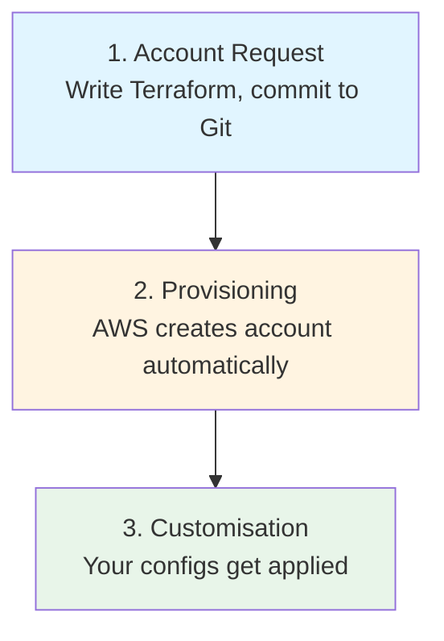
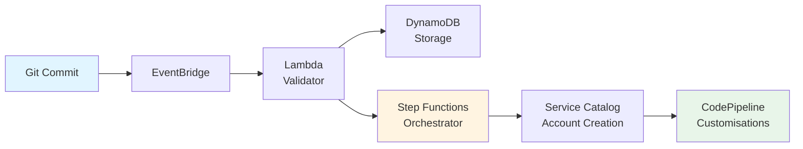

# How It Works

## Three Main Parts



**Flow:** Request → Provision → Customise

---

## The Components



**Request Handler:**
- DynamoDB stores requests
- Lambda validates everything
- EventBridge triggers the workflow

**Provisioning:**
- Step Functions runs the show
- Service Catalog creates account
- Takes about 10 minutes

**Customisation:**
- CodePipeline per account
- Terraform applies your configs
- Takes 20-40 minutes

---

## What Actually Happens

```
You: git commit + push
     ↓
EventBridge: "New request detected"
     ↓
Lambda: "Validating request"
     ↓
DynamoDB: "Details stored"
     ↓
Step Functions: "Starting workflow"
     ↓
AWS: Creates your account
     ↓
Pipelines: Apply your customisations
     ↓
Done: Account ready
```

**Total time: 30-60 minutes**

---

## The Git Repos You Need

Four repos total:

1. **aft-account-request** - Where you request accounts
2. **aft-global-customisations** - Applied to ALL accounts
3. **aft-account-customisations** - Specific account stuff
4. **aft-account-provisioning-customisations** - Pre-setup configs

GitHub, GitLab, or CodeCommit all work.

---

## Security & State

**Terraform state:**
- Lives in S3 (encrypted)
- DynamoDB locks it
- Separate per account

**Security:**
- Everything encrypted
- IAM roles for access
- CloudTrail logs everything
- Control Tower guardrails active
