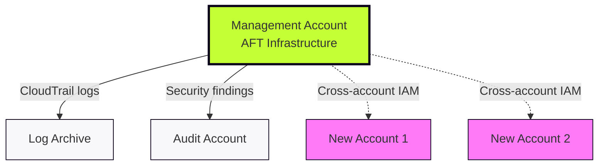
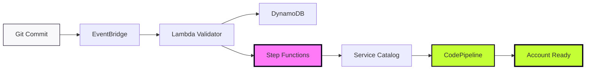

# AFT Architecture & Deployment

## Deploying the AFT Stack (One-Time Setup)

**In the Management Account, AFT provisions:**

* **Request Framework:** EventBridge rules, Lambda validators, DynamoDB audit tables
* **Provisioning Framework:** Step Functions orchestration, Service Catalog integration, cross-account IAM roles
* **Customisation Framework:** CodePipeline templates, CodeBuild execution environments, S3 state backends

**Prerequisites:** Control Tower active, four Git repositories initialised, account IDs collected

---

## Where AFT Operates

AFT runs centrally in the Management account and uses cross-account IAM roles to provision and configure target accounts. No access keys, no long-lived credentials.

---

## The Automated Workflow

---

## Stage 1: Request Validation

**Trigger:** Engineer commits HCL to `aft-account-request` repository

* **EventBridge** detects the commit
* **Lambda** validates the request (HCL syntax, account name uniqueness, email availability, OU validity)
* **DynamoDB** persists the validated request metadata for audit trail

**On Failure:** Request rejected immediately, detailed error logs in CloudWatch, Git commit status updated

---

## Stage 2: Account Provisioning

**Orchestrator:** Step Functions workflow

* **Service Catalog** creates the AWS account
* **Control Tower** applies baseline configuration:
    - Guardrails (preventive and detective)
    - CloudTrail logging to Log Archive
    - Security Hub integration to Audit account
    - SSO access configuration
* **Cross-account IAM role** (`AWSAFTExecution`) established for Terraform operations

**Retry Logic:** Automatic retry with exponential backoff on transient failures  
**On Persistent Failure:** State persisted in DynamoDB, SNS notification sent to operations team

---

## Stage 3: Customisation Execution

**Executor:** Dedicated CodePipeline spawned per account

Terraform configurations applied in sequence:

1. **Provisioning Customisations** (pre-baseline additions)
2. **Global Customisations** (security baseline: GuardDuty, Config, CloudWatch)
3. **Account Customisations** (project-specific: VPCs, IAM roles, applications)

**Approval Gates:** Optional manual approval before apply (configurable per environment)  
**State Management:** Isolated S3 backend + DynamoDB lock per account

**On Failure:** Pipeline halts at failed stage, execution logs in CodeBuild, manual re-run after Git fix

---

## The Flow: Request to Ready

**Step 1:** Engineer commits HCL request to Git

**Step 2:** EventBridge detects commit, Lambda validates request

**Step 3:** Step Functions orchestrate the workflow

**Step 4:** Service Catalog creates account, Control Tower applies baseline

**Step 5:** Provisioning customisations execute (pre-baseline additions)

**Step 6:** Global customisations deploy (security baseline across all accounts)

**Step 7:** Account customisations finalise (project-specific configurations)

**Done:** Account accessible via SSO, ready for workload deployment

**Note:** AFT processes multiple requests concurrently. Provisioning 10 accounts happens in parallel, not sequentially.

---

## Security & Governance

**State Isolation:**
* Each account: dedicated S3 bucket + DynamoDB lock table
* KMS encryption enforced for all state files
* No shared state between accounts

**Access Model:**
* Cross-account IAM roles with least-privilege policies
* No access keys or long-lived credentials
* Temporary STS credentials for all operations

**Compliance:**
* Control Tower guardrails inherited automatically
* CloudTrail audit logs centralised in Log Archive account
* Security findings aggregated in Audit account via Security Hub

---

## The Result

With AFT deployed, account provisioning becomes self-service:

1. Engineer writes HCL request file
2. Pull request reviewed and merged
3. AFT automatically provisions account
4. Engineer receives SSO access
5. Workload deployment begins

**Before:** Manual ticket operations taking days  
**After:** Automated GitOps workflow