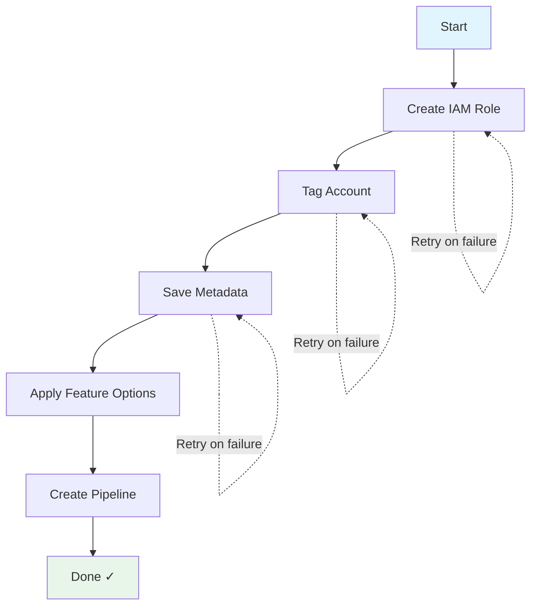
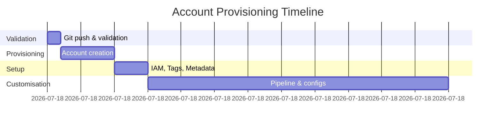

# The Provisioning Flow

## What You Do

Create one Terraform file:

```hcl
# aft-account-request/dev-account.tf

resource "aws_controltower_account_factory_account" "dev" {
  account_name  = "dev-project-alpha"
  account_email = "dev-alpha@example.com"
  organisational_unit_id = "ou-dev-123456"
  
  tags = {
    Environment = "development"
    Team        = "platform"
  }
}
```

Commit. Push. Done.

---

## What AFT Does

**Minutes 0-2: Validation**
- Checks if email is valid
- Confirms OU exists
- Makes sure name isn't duplicate

**Minutes 2-12: Account Creation**
- Service Catalog provisions
- Assigns to OU
- Applies Control Tower guardrails

**Minutes 12-15: Setup**
- Creates IAM role for management
- Adds your tags
- Saves metadata to DynamoDB

**Minutes 15-60: Customisation**
- Creates pipeline for this account
- Runs your Terraform configs
- Sends notification when done

---

## The Step Function



This orchestrates everything. If anything fails, it retries automatically.

---

## Error Handling

**If something breaks:**
- Step Functions retries automatically
- Failed messages go to Dead Letter Queue
- You get SNS notification
- Check CloudWatch logs

**Common issues:**
- Invalid request → Fixed at validation
- Service Catalog timeout → Retried
- Customisation fail → Shows in pipeline
- Manual fix needed → Pipeline logs show what

---

## Notifications

You get alerts for:
- ✓ Request received
- ✓ Account created
- ✓ Customisations started
- ✓ Account ready
- ✗ If anything fails

Slack, email, or webhook—your choice.

---

## Timeline Example



Real example from our setup:

```
00:00 - Git push
00:01 - Validation done
00:02 - Provisioning starts
00:10 - Account created
00:12 - IAM role ready
00:13 - Tags applied
00:15 - Pipeline created
00:25 - Global customisations done
00:45 - Account customisations done
01:00 - Account ready ✓
```
