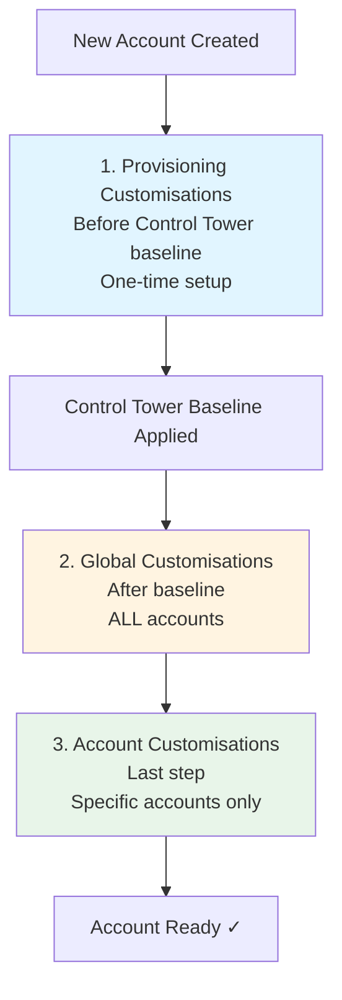
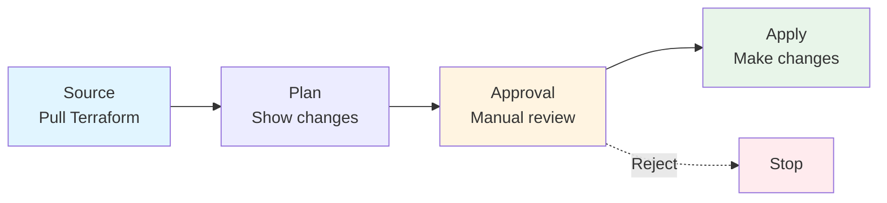
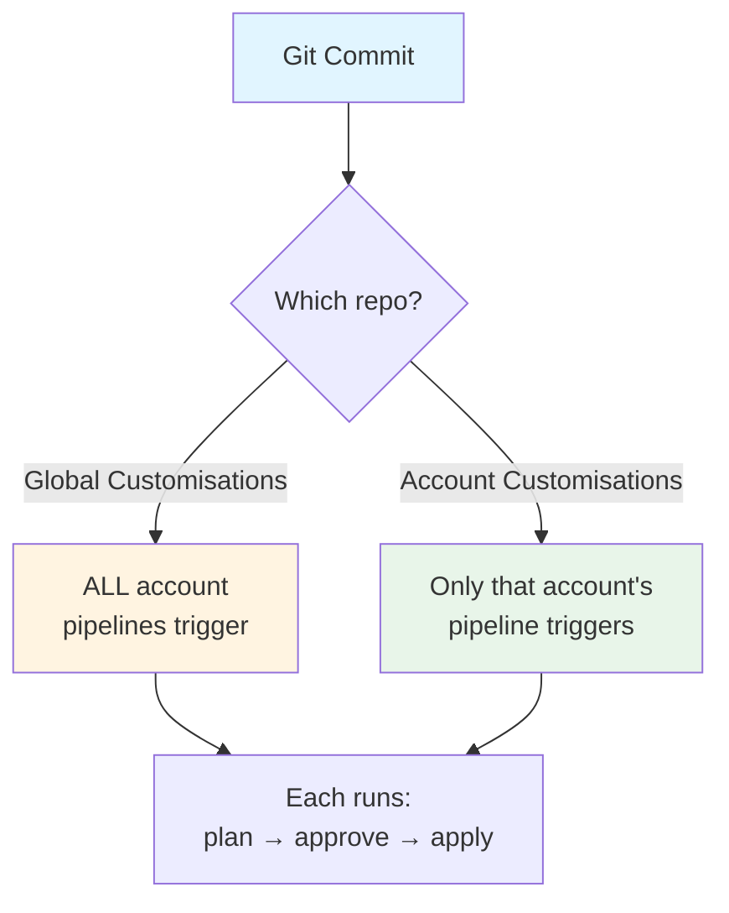

# Customisations

## Three Types



**1. Provisioning Customisations**
- Runs BEFORE Control Tower baseline
- One-time setup
- Example: Pre-create IAM roles

**2. Global Customisations**
- Runs AFTER baseline
- Applied to EVERY account
- Example: Security tools, monitoring

**3. Account Customisations**
- Runs last
- Only for specific accounts
- Example: Dev tools, app-specific config

---

## How Pipelines Work



Each account gets its own pipeline:

**Source:** Pulls your Terraform
**Plan:** Shows what will change
**Approval:** You review and approve
**Apply:** Makes the changes

You approve once, then it runs.

---

## Global Customisations Example

Applied to ALL accounts:

```hcl
# Enable GuardDuty everywhere
resource "aws_guardduty_detector" "main" {
  enable = true
}

# Enable Security Hub
resource "aws_securityhub_account" "main" {
  enable_default_standards = true
}

# CloudWatch logs
resource "aws_cloudwatch_log_group" "central" {
  name              = "/aws/central-logs"
  retention_in_days = 90
}
```

Change this → Updates all accounts.

---

## Account Customisations Example

Only for specific accounts:

```hcl
# Dev account only
locals {
  is_dev = var.environment == "development"
}

# Dev S3 bucket
resource "aws_s3_bucket" "dev_stuff" {
  count  = local.is_dev ? 1 : 0
  bucket = "dev-artifacts-${local.account_id}"
}

# Dev IAM role
resource "aws_iam_role" "dev_deploy" {
  count = local.is_dev ? 1 : 0
  name  = "DevDeployRole"
  # ... role config
}
```

Change this → Only updates that account.

---

## The Approval Gate

**Why we need it:**
- Safety—don't apply blind
- See exactly what changes
- Compliance audit trail

**How it works:**
1. Plan runs
2. You get notification
3. You review in CodePipeline
4. Click approve/reject
5. If approved, it applies

Timeout: 7 days (configurable)

---

## When You Update



**Global customisations:**
- Git push
- ALL account pipelines trigger
- Each runs: plan → approve → apply

**Account customisations:**
- Git push
- Only that account's pipeline triggers
- Runs: plan → approve → apply

---

## State Management

**Each account has:**
- Own S3 bucket for state
- DynamoDB lock table
- Everything encrypted (KMS)
- Versioning enabled

No conflicts. No problems.

---

## Pro Tips

**Organisation:**
- Use modules (don't repeat yourself)
- Variables for different environments
- Tag your releases

**Security:**
- Least privilege IAM
- Encrypt secrets properly
- Use AWS Secrets Manager
- Require PR reviews

**Testing:**
- Test in dev first
- Check plan output carefully
- Keep blast radius small
