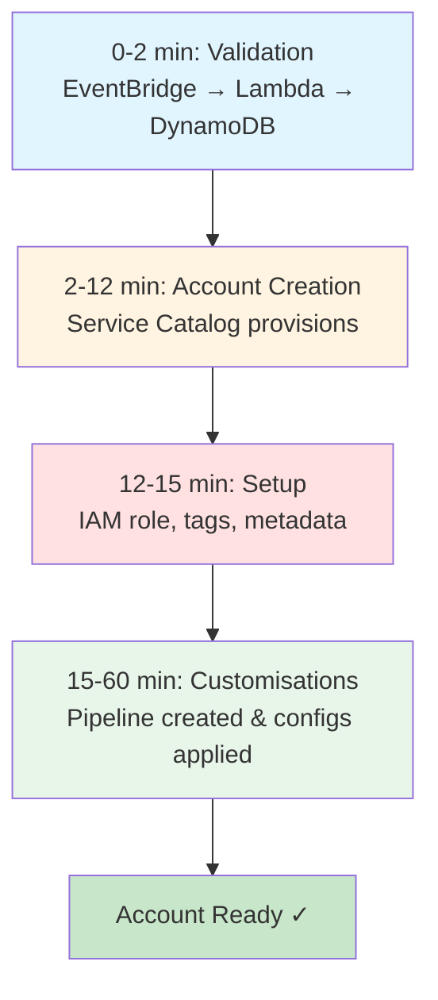

# Demo Walkthrough

## Scenario: New Dev Account

**What we need:**
- Account name: `dev-project-alpha`
- Email: `dev-alpha@example.com`
- OU: Development
- Tags: Environment=dev, Project=alpha

---

## Step 1: Create Request

Write one file:

```hcl
# In aft-account-request repo

resource "aws_controltower_account_factory_account" "dev_alpha" {
  account_name           = "dev-project-alpha"
  account_email          = "dev-alpha@example.com"
  organisational_unit_id = "ou-dev-123456"
  
  tags = {
    Environment = "development"
    Project     = "alpha"
    ManagedBy   = "AFT"
  }
}
```

Commit. Push. Wait.

---

## Step 2: Watch It Work



**What's happening:**

**0-2 min:** Validation
- EventBridge picks up commit
- Lambda checks everything
- DynamoDB stores details

**2-12 min:** Account creation
- Service Catalog provisions
- OU assignment
- Control Tower guardrails

**12-15 min:** Setup
- IAM role created
- Account tagged
- Metadata saved

**15-60 min:** Customisations
- Pipeline created
- Global configs applied
- Account configs applied

---

## Step 3: Monitor Progress

**Check these:**
- Step Functions execution graph
- CodePipeline stages
- DynamoDB audit table
- CloudWatch logs

You'll see each step complete.

---

## Step 4: Verify

**When it's done, check:**
- ✓ Account in correct OU
- ✓ `AWSAFTExecution` role exists
- ✓ All tags applied
- ✓ GuardDuty enabled
- ✓ Security Hub enabled
- ✓ CloudWatch logs setup

---

## Real Use Cases

**Multi-environment:**
Create dev, staging, prod in ~60 minutes total

**Compliance:**
Every account has same security baseline

**Scaling:**
Need 10 accounts? Provision in parallel, not one by one

---

## The Numbers

**Average provisioning:**
- Account creation: ~10 min
- Customisations: ~30-40 min
- Total: ~45-60 min

**Success rate:** 95%+ (retries handle failures)

---

## If Something Breaks

**Check in order:**
1. Step Function execution logs
2. Lambda CloudWatch logs
3. DynamoDB audit table
4. CodePipeline execution
5. Terraform plan output

Most issues are in validation or IAM permissions.

---

## Summary

One Terraform file → Fully configured account in 1 hour

**What you get:**
- ✓ Fast provisioning
- ✓ Consistent setup
- ✓ Complete audit trail
- ✓ GitOps workflow
- ✓ Scales properly

---

## Next Steps

**To implement:**
1. Deploy AFT in management account
2. Set up 4 Git repos
3. Define global customisations
4. Test with one account
5. Document your process
6. Train your team

**Resources:**
- AWS AFT docs
- Terraform AWS provider
- This presentation repo
